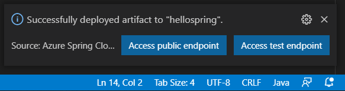
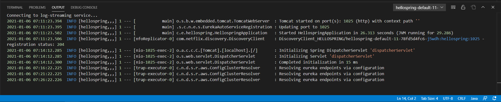

# Azure Spring Cloud for Visual Studio Code (Preview)

<!-- region exclude-from-marketplace -->

 

<!-- endregion exclude-from-marketplace -->

[Azure Spring Cloud](https://azure.microsoft.com/services/spring-cloud/) provides a managed service that lets you run microservices on Azure using Spring-boot with no code changes. Use the Azure Spring Cloud extension
for VS Code to quickly create, manage and deploy apps to an Azure Spring Cloud instance.

> Sign up today for your free Azure account and receive 12 months of free popular services, $200 free credit and 25+ always free services 👉 [Start Free](https://azure.microsoft.com/free/open-source).

<!-- region exclude-from-marketplace -->
## Installation

1. Download and install the [Azure Spring Cloud extension](https://marketplace.visualstudio.com/items?itemName=ms-azuretools.vscode-azurespringcloud) for Visual Studio Code
2. Wait for the extension to finish installing then reload Visual Studio Code when prompted
3. Once complete, you'll see an Azure icon in the Activity Bar
    > If your activity bar is hidden, you won't be able to access the extension. Show the Activity Bar by clicking View > Appearance > Show Activity Bar
4. Sign in to your Azure Account by clicking Sign in to Azure…
    >  If you don't already have an Azure Account, click "Create a Free Azure Account" or you can [try Azure for free](https://code.visualstudio.com/tryappservice/?utm_source=appservice-extension)

## Deploy your first Spring Boot app to Azure Spring Cloud
Once you are signed in to your Azure account and you have your app open in Visual
Studio Code, click the Azure icon in the Activity Bar to open the Azure Explorer and you will see the Azure Spring Cloud panel.

1. Right-click on your subscription and click **Create Service in Portal**. Finish the following steps on Azure Portal to create an Azure Spring Cloud service instance.

    

1. After the service instance is created, refresh the Azure Explorer and it will show up. Right-click on the service instance and click **Create App**. Type app name, select
Java version and then press **Enter** to start creating.

    

1. The app will be ready in a few minutes, right click on the App and click **Deploy**, select your built Jar file when prompted.

    

1. You can see the deployment status on the bottom right. Once done, click **Access Public Endpoint**, click **Yes** when prompted to assign public endpoint.

    

## Scale the App

1. You can easily scale the app by right click on the **Instance count** under Scale Settings and click **Edit**. Type **2** and press **Enter** to scale the app.

    

## Stream Your Application Logs

1. Expand the App Instances node, right click the instance you want to see logs and click **Start Streaming Logs**.

    

1. The Visual Studio Code output window opens with a connection to the log stream

    

## Contributing

There are a couple of ways you can contribute to this repo:

* **Ideas, feature requests and bugs**: We are open to all ideas and we want to get rid of bugs! Use the Issues section to either report a new issue, provide your ideas or contribute to existing threads.
* **Documentation**: Found a typo or strangely worded sentences? Submit a PR!
* **Code**: Contribute bug fixes, features or design changes:
  * Clone the repository locally and open in VS Code.
  * Install [TSLint for Visual Studio Code](https://marketplace.visualstudio.com/items?itemName=ms-vscode.vscode-typescript-tslint-plugin).
  * Open the terminal (press `CTRL+`\`) and run `npm install`.
  * To build, press `F1` and type in `Tasks: Run Build Task`.
  * Debug: press `F5` to start debugging the extension.

### Legal

You will need to sign a **Contribution License Agreement** before we can accept your pull request. 
All you need to do is to submit a pull request, then the PR will get appropriately labelled (e.g. `cla-required`, `cla-norequired`, `cla-signed`, `cla-already-signed`). If you already signed the agreement we will continue with reviewing the PR, otherwise system will tell you how you can sign the CLA. Once you sign the CLA all future PR's will be labeled as `cla-signed`.

### Code of Conduct

This project has adopted the [Microsoft Open Source Code of Conduct](https://opensource.microsoft.com/codeofconduct/). For more information see the [Code of Conduct FAQ](https://opensource.microsoft.com/codeofconduct/faq/) or contact [opencode@microsoft.com](mailto:opencode@microsoft.com) with any additional questions or comments.

<!-- endregion exclude-from-marketplace -->

## Telemetry

VS Code collects usage data and sends it to Microsoft to help improve our products and services. Read our [privacy statement](https://go.microsoft.com/fwlink/?LinkID=528096&clcid=0x409) to learn more. If you don’t wish to send usage data to Microsoft, you can set the `telemetry.enableTelemetry` setting to `false`. Learn more in our [FAQ](https://code.visualstudio.com/docs/supporting/faq#_how-to-disable-telemetry-reporting).

## License

[MIT](LICENSE.md)
